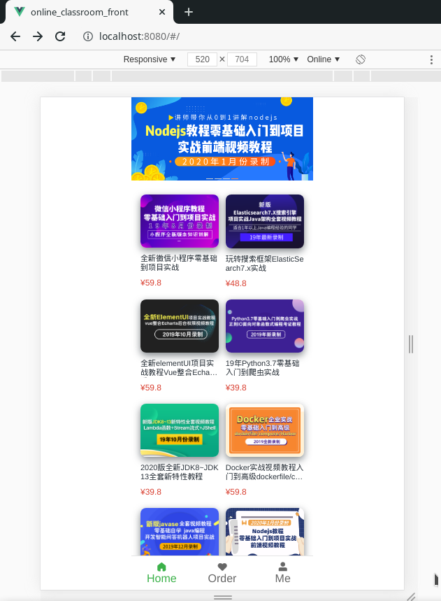
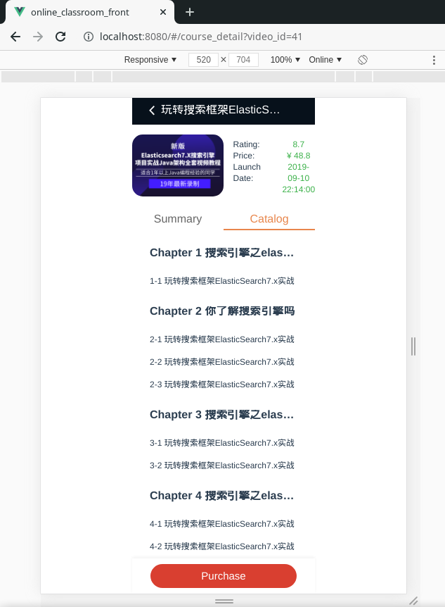
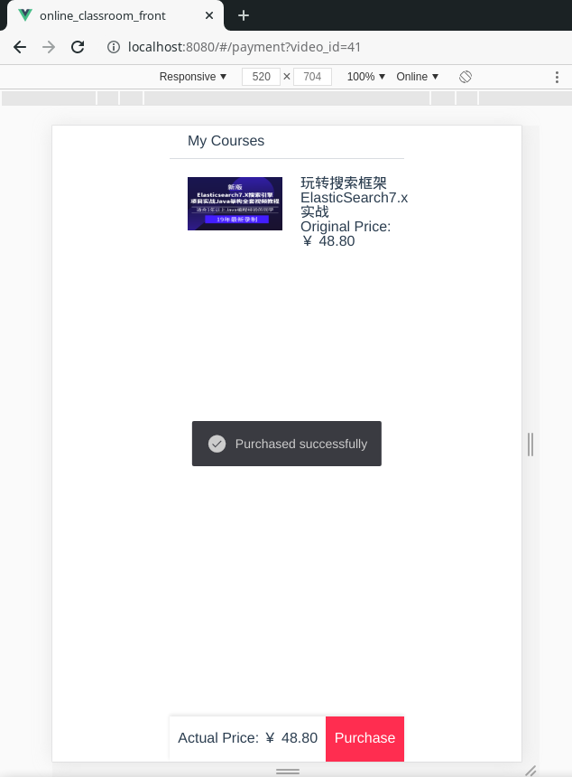

# Online Education Platform

## Introduction

This is an online-classroom which offers software-development-relevant online courses. Individuals can order any course and check their purchase record after enrollment.

## Tech Stacks

### Backend

- **Spring Boot 2.x** + **Spring 5** + **MyBatis 3.x** + **MySQL 5.7** + **JWT** + **Guava**

### Frontend

- **Vue.js** + **Cube-UI** + **Axios** + **NPM**

## Presentations
**There is a rotating banner on top of the homepage, containing multiple sliders**

**The syllabus of each course**

**Place an order**

